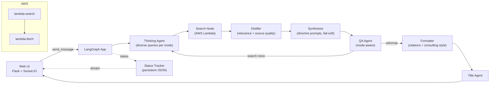

# 🧠 Perplex‑Lite (Lambda + MCP) – Research Assistant

> LangGraph research app with Flask + Socket.IO UI. Offloads web search and content extraction to AWS Lambda, synthesizes answers with citations, and streams step‑by‑step status to the UI.


## ✨ What you get
- Thinking → Search → Distill → Synthesize → QA/Formatter → Title pipeline (LangGraph)
- Web search and extraction executed by AWS Lambda (parallelized; cached; retries with jitter)
- Beautiful Flask UI (dark) with live “waterfall” status (Socket.IO) and source cards
- Two operating modes:
  - Fast: single pass; shorter answer; no re‑search loops
  - Thorough: 7–10 diverse queries; up to 2 QA loops; long consulting‑style report
- Citations preserved and shown only if actually referenced in the answer
- Conversation logging + titles; resume in‑flight analysis upon reconnect
- Hardened frontend: DOMPurify (XSS), Prism.js (code highlight), copy buttons
- Structured logs with rotation (logs/perplex‑lite.log)

## 🏗 Architecture


## 🔌 Serverless Search Backend (Lambda)
This app expects your two Lambda functions to be deployed:
- `lambda-search` – takes a query, calls DuckDuckGo, fans out to fetchers
- `lambda-fetch` – Playwright Chromium fetch; extracts & returns page content as markdown (base64)

You already built these; your Lambda README (included in your Lambda repos) is compatible. Keep the result fields (`url`, `content_b64_md` or `markdown_content`) as the app decodes these. Ensure non‑empty content so synthesis has enough evidence.

## 📂 Project Structure (app)
```
perplex-lite-lambda-mcp/
├─ aws/
│  └─ lambda_client.py        # caching, retries, mock fallback (dev)
├─ nodes/
│  ├─ thinking.py             # query analysis, mode-aware diversity
│  ├─ search_lambda.py        # parallel Lambda invocations
│  ├─ distiller.py            # filter, score, truncate (up to 2000 chars)
│  ├─ synthesize.py           # directive prompts, citation parsing
│  ├─ qa_agent.py             # mode-aware loops and length checks
│  ├─ formatter.py            # consulting-style (thorough), sources
│  └─ title_agent.py          # one-shot title
├─ utils/
│  ├─ conversation_manager.py # logs + status passthrough
│  ├─ status_tracker.py       # persistent status w/ history for replay
│  └─ text.py                 # keyword scoring
├─ templates/
│  └─ index.html              # dark UI, DOMPurify, Prism, mode toggle
├─ graph.py                   # LangGraph wiring + conditional edges
├─ flask_app.py               # API + Socket.IO + status streaming
├─ requirements.txt
├─ .env.example
└─ README.md (this)
```

## ⚙️ Setup
### 1) Prerequisites
- Python 3.11+
- AWS credentials (for Lambda) via `~/.aws/credentials` or env vars
- Gemini API key (Google Generative AI)

### 2) Install
```bash
python -m venv .venv
# Windows PowerShell
. .venv/ScriptS/Activate.ps1
# or bash
source .venv/bin/activate
pip install -r requirements.txt
```

### 3) Configure env
Copy `.env.example` → `.env` and set values:
```
GEMINI_API_KEY=your_gemini_key
AWS_REGION=ap-south-1
LAMBDA_FUNCTION_NAME=lambda-search
LOG_LEVEL=INFO
SEARCH_TTL_SECONDS=120
```

### 4) Run the app
```bash
python flask_app.py
# http://127.0.0.1:5000
```

## 🧭 Using the App
- Choose mode in the toggle above the input:
  - Fast: single pass; QA never triggers new searches; concise answers
  - Thorough: 7–10 queries; up to 2 QA loops; long consulting report
- Type your query; watch live steps (“Analyzing…”, “Searching…”, “Distilling…”) appear as a waterfall in the chat
- Citations show as source cards and footnotes; only URLs actually referenced are listed
- Left sidebar:
  - Click a past conversation to reopen; if analysis is running, prior status steps replay with a “↻” marker
  - Trash icon deletes the conversation (removes JSON file)

## 🧩 Agents & Modes
- Thinking: generates diverse search queries (Fast: 3–5, Thorough: 7–10)
- Search (Lambda): parallel calls; caching (tiny TTL); retry with jitter
- Distiller: combined score = 70% relevance + 30% source quality; keeps up to 8 items
- Synthesis: directive prompts forbid asking “what should we start with”; fail‑soft to context if evidence too low
- QA (mode-aware):
  - Fast: never requests more data; suggests reformatting only
  - Thorough: can request up to 2 new search loops; ensures ≥ 4000 words
- Formatter:
  - Fast: polish + citations
  - Thorough: enforces consulting‑style structure and long form; citations appended
- Title Agent: runs once (first complete reply)

## 🔒 Frontend Safety & UX
- Rendering: `marked` → `DOMPurify.sanitize` (prevents XSS)
- Code: Prism.js highlighting + Copy buttons on blocks
- Source cards: favicon + domain chips below answer
- Reconnection UX: status history is persisted and replayed to the UI
- Controls: header toolbar (toggle sidebar, clear chat), scroll‑to‑bottom FAB

## 🧪 API & Events (for integrators)
REST
- `GET /api/conversations` – list
- `GET /api/conversations/:id` – details (title)
- `GET /api/conversations/:id/messages` – messages
- `DELETE /api/conversations/:id` – delete
- `GET /api/conversations/:id/status` – current status
- `POST /api/conversations/:id/resume` – resume if active
- `GET /api/active-conversations` – list active

Socket.IO events
- emit `send_message` { conversation_id?, message, mode }
- on `processing_status` { status, message, data, is_replay }
- on `assistant_response` { conversation_id, response, citations }
- emit `join_conversation`, emit `request_status`

## ⚙️ Configuration Knobs
- `.env`:
  - `SEARCH_TTL_SECONDS` – cache TTL for Lambda results
  - `LOG_LEVEL` – INFO/DEBUG
- Distiller: truncation to 2000 chars; keeps top 8 by combined score
- Synthesis: citation markers parsed as `[n]` or `[^n]`
- Lambda client: retries with exponential backoff + jitter; caches results

## 🚀 Deployment Notes
- Run Flask behind a production WSGI server (e.g., gunicorn + eventlet/gevent) and a reverse proxy (Nginx)
- Set `FLASK_ENV=production` (disable debug reloader)
- Persist `conversations/` and `analysis_status/` volumes for resilience
- Ensure Lambdas are warm and have adequate concurrency; consider CloudWatch alarms

## 🧯 Troubleshooting
- “UnicodeEncodeError” on Windows consoles:
  - The app reconfigures stdout/stderr to UTF‑8; ensure you’re using the provided `flask_app.py` (or use a UTF‑8 console)
- Citations missing:
  - Ensure Lambda returns non‑empty content fields (`content_b64_md` or `markdown_content`)
  - Thorough mode yields more evidence → better citations
- Button stuck / status not updating:
  - The UI has a 2‑min safety timer; ensure Socket.IO events are flowing and you’ve joined the conversation room

## 🤝 Related: Lambda README (Search + Fetch)
You provided a great README for the dual‑Lambda backend covering DuckDuckGo search, Playwright fetch, parallel invocations, guardrails, and deploy scripts. Keep those repos in sync with this app’s expected fields and endpoint names. The app’s `aws/lambda_client.py` expects the `lambda-search` output to include a `results` array with each item containing a `url` and content in `content_b64_md` (base64 markdown) or `markdown_content`.

## 📜 License
MIT © 2025
